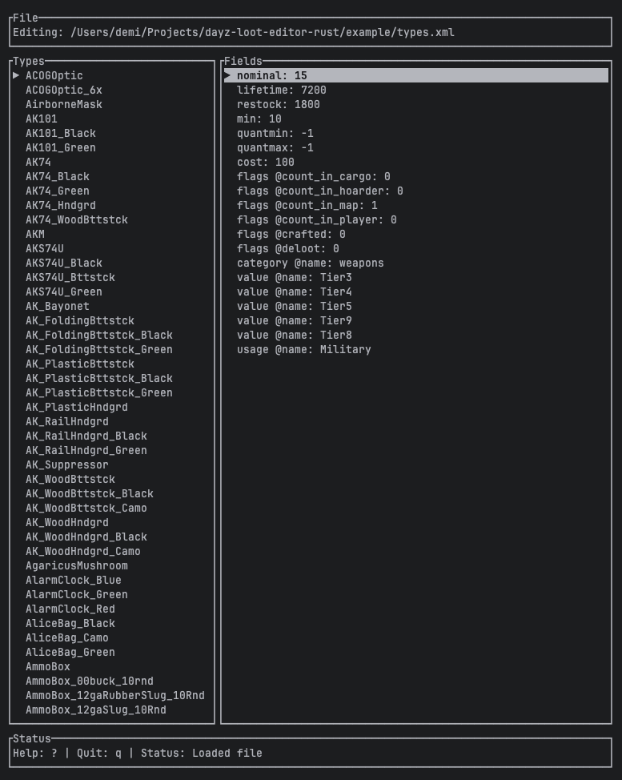

DayZ Loot Editor (Rust)
=======================

A terminal UI (TUI) for browsing DayZ `types.xml` files, inspecting loot types, and editing fields quickly without leaving your terminal. Built with `tui` + `crossterm`.



Features
--------
- File picker to choose a `types.xml` (with error feedback for unsupported files).
- Optional SSH mode: connect via SFTP to browse/edit remote `types.xml` (enter host/creds in-app; works with key auth).
- Two-pane editor: type list on the left, fields on the right.
- Inline editing for type names and field values.
- Add, copy, and delete types or fields with keyboard shortcuts.
- Save back to XML with indentation.
- Toggleable in-app help overlay.

Controls
--------
**Global**
- `?` toggle help overlay
- `q` quit

**File Picker**
- Up/Down or `j`/`k` to move
- Enter to open directory or select file
- `r` toggle SSH: opens a prompt to enter host/user/port and optional password/key; Enter to connect; `r` again to switch back to local
- Errors (e.g., unsupported file) are shown in the status bar

**Editor**
- Up/Down or `j`/`k` to move; Left/Right to switch pane
- Enter to edit; type to change text; Enter to apply; Esc to cancel
- `a` add (type when on the type pane, field when on the field pane)
- `c` copy current type/field
- `d` delete current type/field
- `s` save

Running
-------
```bash
cargo run
```

If you see a terminal permission error in some environments, run in a regular terminal outside restricted sandboxes.

Project Layout
--------------
- `src/file_picker.rs` — directory navigation and status handling
- `src/editor.rs` — XML parsing, editing, saving, and help overlay
- `src/remote.rs` — SSH/SFTP backend and file source tagging
- `src/action.rs` — shared action enum for key handling
- `example/types.xml` — sample DayZ loot types file

Contributing
------------
1. Ensure Rust toolchain is installed (`rustup`).
2. Check/build before submitting:
   ```bash
   cargo check
   cargo test   # if/when tests are added
   ```
3. Keep code formatted with `cargo fmt` (if already in use).
4. Submit a PR with a clear description of changes and testing done.

Feel free to open issues for bugs or feature requests. Happy editing!
